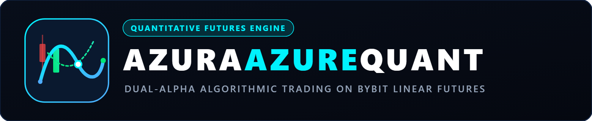
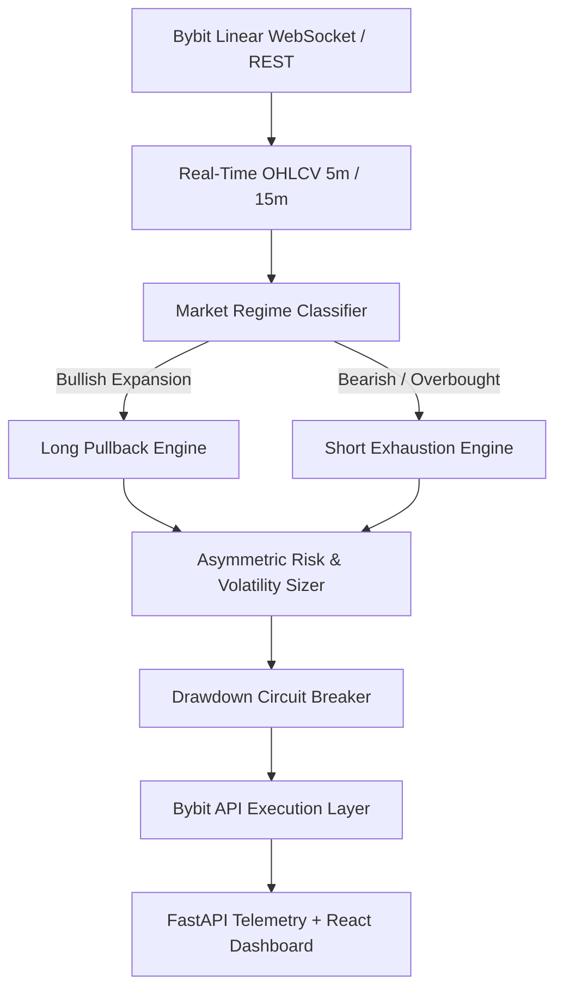

<p align="center">
  
</p>

<p align="center">
  <b>High-Frequency &amp; Quantitative Dual-Alpha Trading Framework for Bybit Linear Perpetual Futures</b>
</p>

<p align="center">
  <a href="https://www.python.org/downloads/release/python-3110/"></a>
  <a href="https://www.freqtrade.io/"></a>
  <a href="https://www.bybit.com/"></a>
  <a href="https://fastapi.tiangolo.com/"></a>
  <a href="https://opensource.org/licenses/MIT"></a>
</p>

---

## 1. Executive Overview

**AzuraAzureQuant** is a production-grade quantitative futures trading system engineered for Bybit USDT-Margined Linear Perpetuals. Extending the robust architectural foundation of Freqtrade, the system addresses the critical mathematical shortcoming of retail trading algorithms: the **Winrate Fallacy** (high nominal win rates masked by catastrophic tail-risk drawdowns during regime shifts).

The framework implements a proprietary **Dual-Alpha Architecture** (ApexDualAlpha) that decouples market dynamics into two non-correlated edge generators:
1. **Long Alpha (Trend-Pullback Continuation):** Captures high-momentum expansions by identifying exhaustion pullbacks into structural moving average cushions with volatility compression filters.
2. **Short Alpha (Overextension & Resistance Climax):** Exploits volatility blow-offs and liquidity sweeps above multi-timeframe resistance bands, profiting from rapid mean-reversion waterfalls.

Integrated with asymmetric leverage calibration, hard volatility circuit breakers, and an independent telemetry server, AzuraAzureQuant delivers rigorous algorithmic execution across 5-minute and 15-minute execution timeframes.

---

## 2. Quantitative Architecture & Strategy Design



### Core Algorithmic Engines
- **ApexDualAlpha (Omni V1 to V11 Ultimate):** The flagship engine family combining multi-timeframe EMA alignment (EMA 9 / 21 / 50 / 200), RSI dynamic bands, Bollinger Band bandwidth percentile, and Chaikin Money Flow (CMF) confirmation.
- **Asymmetric Risk Calibration:** Long positions apply trend-following trailing stop-loss buffers with wider targets, whereas Short positions operate on rapid scalp profit-taking with compressed breakeven triggers to guard against short squeezes.
- **Drawdown Circuit Breaker:** Automated trade suspension upon reaching pre-set daily capital exposure limits, preventing revenge-trading anomalies and API latency cascade.

---

## 3. Telemetry & Monitoring Architecture

In addition to headless CLI trading, AzuraAzureQuant features a custom local observability stack:
- **Telemetry Server (`dashboard_server.py`):** A lightweight FastAPI/Python service operating on port 5050 that continuously parses active SQLite trade journals, computes rolling Sharpe/Sortino ratios, and streams real-time PnL metrics.
- **Modern Web Dashboard (`dashboard/`):** A high-performance React + Vite user interface designed with dark-mode financial terminals in mind, displaying open positions, win/loss distributions, margin utilization, and strategy telemetry.

---

## 4. Repository Structure

```text
.
|-- .gitignore                      # Strict zero-leakage filter (secrets, DBs, logs)
|-- assets/
|   `-- logo.svg                    # Scalable vector branding mark (dark/light adaptable)
|-- README.md                       # Comprehensive English technical documentation
|-- requirements.txt                # Core Python package dependencies
|
|-- dashboard_server.py             # FastAPI trade monitoring and PnL metrics daemon
|-- analyze_trades.py               # Post-trade log analytics and performance extraction
|-- compare_strategies.py           # Multi-strategy backtest tear-sheet comparative tool
|-- generate_tearsheet.py           # Automated tearsheet generator for Sharpe/drawdown audits
|-- simulate_candidate_engines.py   # Signal simulation harness for candidate alpha models
|-- test_signals_unit.py            # Unit testing suite for indicator signal integrity
|
|-- dashboard/                      # Real-time React + Vite web dashboard source code
|   |-- package.json
|   |-- vite.config.ts
|   `-- src/                        # Dashboard UI components, hooks, and views
|
`-- user_data/                      # Freqtrade user configuration & execution space
    |-- config_futures.json         # Sanitized production Bybit Linear Futures template
    |-- strategies/                 # Production strategy library
    |   |-- ApexDualAlpha_Omni_V1.py
    |   |-- ApexDualAlpha_Omni_V7.py
    |   |-- ApexDualAlpha_Omni_V11_Ultimate.py
    |   |-- ApexDualAlpha_HighVelocity.py
    |   |-- ApexDualAlpha_Institutional.py
    |   |-- ApexDualAlpha_Shield.py
    |   |-- ApexDualAlpha_Supreme.py
    |   `-- ApexDualAlpha_TriAlpha.py
    `-- pairs.json                  # Linear futures active watchlist
```

---

## 5. Quickstart & Installation

### 1. Environment Setup
```bash
# Clone the repository
git clone https://github.com/geovanybramanthya-bot/AzuraAzureQuant.git
cd AzuraAzureQuant

# Create and activate virtual environment
python -m venv .venv
# Windows:
.venv\Scripts\activate
# Linux/macOS:
source .venv/bin/activate

# Install dependencies
pip install --upgrade pip
pip install -r requirements.txt
```

### 2. Configure Credentials
Copy the sanitized configuration template and add your Bybit API keys:
```bash
cp user_data/config_futures.json user_data/config_futures.local.json
```
Edit `user_data/config_futures.local.json` to insert your `key` and `secret`. *Never commit this local file.*

### 3. Backtesting Strategy
```bash
freqtrade backtesting \
  --config user_data/config_futures.local.json \
  --strategy ApexDualAlpha_Omni_V11_Ultimate \
  --timeframe 5m \
  --timerange 20260101-20260601
```

### 4. Running the Telemetry Server & Dashboard
```bash
# Terminal 1: Launch telemetry daemon
python dashboard_server.py

# Terminal 2: Launch frontend dashboard
cd dashboard
npm install
npm run dev
```

---

## 6. Zero-Leakage Security Policy

This repository adheres to a strict zero-leakage standard enforced by `.gitignore`:
- **API Keys & Secrets:** `.env`, `.env.*`, `*.key`, `*.secret`, and raw exchange credentials are systematically excluded.
- **Database Hygiene:** `tradesv3.*`, `*.sqlite`, `*.sqlite-shm`, and legacy databases are completely blocked from version control to prevent state pollution.
- **Raw Market Data:** Large historical OHLCV data caches (`user_data/data/`, `*.feather`, `*.parquet`) are kept local.

---

## 7. Disclaimer

*This software is published strictly for educational, research, and algorithmic engineering purposes. Cryptocurrency and derivative futures trading carry substantial financial risk of loss. Past backtested performance is not indicative of future market returns. Always verify strategy logic in paper-trading (dry-run) mode prior to allocating capital.*

---

## 8. License & Authorship

- **Author:** Geovany Bramanthya Samuel Sihombing (Azura)
- **License:** MIT Open Source License
